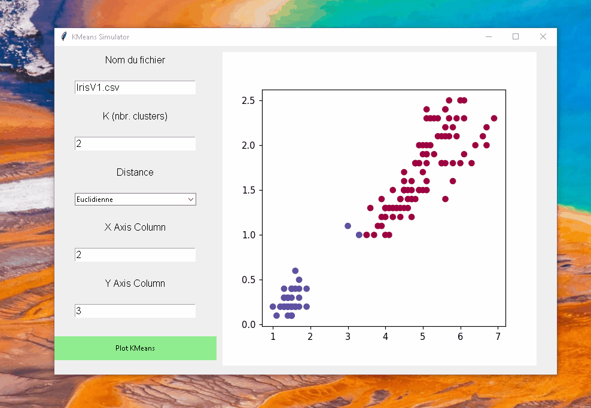

# KMeans-Clustering-Visualizer
A KMeans clustering visualizer, made using python and Tkinter.
This is a Machine Learning project that was made during a course at my university (ESILV).
This python application can help visualize data clusters using the KMeans clustering algorithm, which was made from scratch.

This KMeans algorithm can accept the following parameters: 
- File Name (file format extension is mandatory)
- Number of Clusters (K)
- Distance Type (either Euclidian or Manhattan)
- X Column to visualize
- Y Column to visualize

Currently, I think only CSV files are accepted for the data processing.
Some parts of the code were inspired from this video :
https://www.youtube.com/watch?v=W4fSRHeafMo

More details on KMeans Clustering :
https://www.youtube.com/watch?v=EItlUEPCIzM
